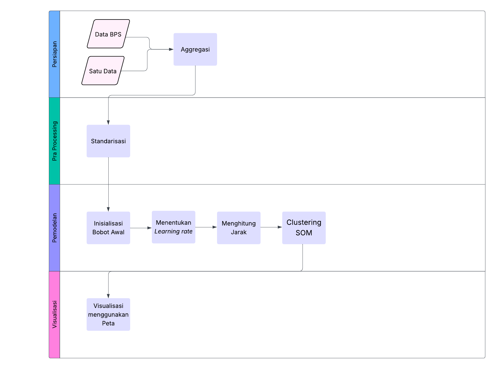

<div align="center">

---

# Data Gengs
### Pengelompokan Provinsi di Indonesia Berdasarkan Indeks Khusus Penanganan Stunting Menggunakan Self Organizing Maps (SOM)

</div>

---

## 📄 Deskripsi Project

Proyek ini bertujuan untuk mengelompokkan Provinsi di Indonesia berdasarkan Indeks Khusus Penanganan Stunting (IKPS) menggunakan metode Self Organizing Maps (SOM). SOM adalah algoritma unsupervised learning yang digunakan untuk memetakan data ke dalam bentuk visual yang mudah dipahami. Dengan metode ini, wilayah-wilayah dengan karakteristik penanganan stunting yang mirip akan tergabung dalam satu klaster. Proyek ini diharapkan dapat membantu pengambil kebijakan dalam mengidentifikasi daerah prioritas intervensi serta merancang strategi yang lebih tepat sasaran.

---

## 🧠 Latar Belakang

---
## 👶 Indeks Khusus Penanganan Stunting (IKPS)
Indeks khusus penanganan stunting (IKPS) merupakan suatu alat khusus untuk menghitung jangkauan intervensi gizi terkait penanganan stunting pada rumah tangga yang menjadi sasaran. IKPS dirancang untuk mengevaluasi berbagai strategi pencegahan stunting di Indonesia, sekaligus untuk memenuhi delapan kesepakatan Disbursement Linked Indicators (DL) antara pemerintah Indonesia dan Bank Dunia.

IKPS sangat bermanfaat bagi Kementerian/Lembaga di tingkat pusat, dan juga dapat dimanfaatkan oleh pemerintah daerah. Hal ini karena, IKPS merupakan indeks yang dapat dipantau secara berkala untuk pemantauan dan evaluasi program pencegahan stunting. IKPS dapat mengkoordinasikan kepentingan Kementerian/Lembaga untuk melaksanakan pencegahan stunting. Di sisi lain, IKPS juga secara tidak langsung dapat mencerminkan variasi bagaimana pemerintah daerah melakukan pelaksanaan program pencegahan stunting.

IKPS di susun melalui beberapa fase, yaitu mulai dari pemetaan indikator penyusun IKPS, normalisasi indikator, penentuan penimbang, penghitungan  IKPS, hingga penyusunan laporan. Penentuan dimensi dan indikator  pada IKPS harus memenuhi prinsip SMART yaitu Specific, Measurable, Achievable, Realistic, dan Timely and Simplicity. Berdasarkan prinsip SMART tersebut, 
maka terbentuk 6 dimensi dan 12 indikator dari penyusun IKPS. Berikut mengenai dimensi dan indikator penyusun IKPS.

<div align="center">

<p align="center">Gambar dimensi dan indikator IKPS</p>
</div>

---

## 🗺️ Self Organizing Maps (SOM)
Self Organizing Maps (SOM) merupakan perluasan dari jaringan kompetitif yang sering disebut dengan jaringan Kohonen. Jaringan ini termasuk dalam pembelajaran tak terawasi (*unsupervised learning*) dan pertama kali diperkenalkan oleh Teuvo Kohonen pada tahun 1981. Pada jaringan ini, suatu lapisan yang berisi neuron-neuron akan menyusun dirinya sendiri berdasarkan input nilai tertentu dalam suatu kelompok yang dikenal dengan istilah *klaster*. Selama proses penyusunan diri, *klaster* yang memiliki bobot paling cocok dengan pola input (memiliki jarak paling dekat) akan terpilih sebagai pemenang. Neuron yang menjadi pemenang beserta neuron-neuron tetangganya akan memperbaiki bobot-bobotnya.

Metode ini memungkinkan untuk menggambarkan data multidimensi ke dalam dimensi yang lebih kecil, biasanya satu atau dua dimensi. Proses penyederhanaan ini dilakukan dengan mengurangi vektor yang menghubungkan masing-masing *node*. Cara ini disebut juga dengan *Vector Quantization*. Teknik yang dipakai dalam metode SOM dilakukan dengan membuat jaringan yang menyimpan informasi dalam bentuk hubungan *node* dengan *training set* yang ditentukan.

SOM memperlihatkan tiga karakteristik:
* **Kompetisi**: setiap vektor bobot saling berlomba untuk menjadi simpul pemenang.
* **Kooperasi**: setiap simpul pemenang bekerjasama dengan lingkungannya.
* **Adaptasi**: perubahan simpul pemenang dan lingkungannya.

### Arsitektur Jaringan SOM

Pada SOM, jaringan terdiri dari 2 *layer*, yaitu *layer* input dan *layer* output. Setiap *node* dari input terhubung dengan seluruh *node* pada *layer* output. Namun *node* pada *layer* output (neuron) tidak terhubung satu sama lain. *Node* dalam *layer* output ini disebut juga *map node*. *Output layer* dapat berdimensi 1 atau 2. *Layer* ini juga dapat disebut sebagai *computational layer* atau *competitive layer* karena *node*-*node* pada *layer* ini berkompetisi dan selalu diperbarui bobotnya. Baik input maupun output, *node* merupakan *array* yang menyimpan informasi karakteristik, atribut maupun ciri.

<div align="center">

<p align="center">Gambar Arsitektur SOM</p>
</div>

### Topologi SOM

SOM memiliki 3 jenis topologi hubungan ketetanggaan (*neighborhood*) yaitu *linear array*, *rectangular grid* dan *heksagonal grid*.
1.  **Linear Array**: Menunjukkan *klaster unit* yang tersusun secara *linear*. *klaster unit* yang menjadi pemenang `[#]` memiliki dua unit tetangga (*neighbour*) yang berjarak 1 `()` dan mempunyai dua unit tetangga (*neighbour*) yang berjarak 2 `{}`.
   
<div align="center">

<p align="center">Gambar Linear Array Unit</p>
</div>

2.  **Rectangular Grid**: Adalah topologi dari *klaster unit* dua dimensi. Unit tetangga (*neighbour*) dari unit pemenang membentuk bujur sangkar. Unit pemenang `[#]` memiliki 8 tetangga (*neighbour*) yang berjarak 1 (`R=1`) dan 16 tetangga (*neighbour*) yang berjarak 2 (`R=2`).

<div align="center">

<p align="center">Gambar Rectangular Grid</p>
</div>

3.  **Heksagonal Grid**: Dalam topologi ini, unit pemenang `[#]` memiliki 6 tetangga (*neighbour*) yang berjarak 1 (`R=1`) dan 12 tetangga (*neighbour*) yang berjarak 2 (`R=2`).

<div align="center">

<p align="center">Gambar Hexagonal Grid</p>
</div>

### Algoritma SOM

Pada prinsipnya algoritma SOM mempunyai 2 proses perhitungan matematika, yaitu pada proses pencarian nilai bobot yang sesuai dengan nilai masukan dan perubahan nilai bobot yang telah ditemukan dengan jarak terdekat. Tahapan-tahapan dalam analisis *klastering* menggunakan SOM adalah sebagai berikut:
1.  **Inisialisasi Bobot Awal**: Berupa bobot ($w_{ij}$) yang diperoleh secara acak untuk tiap *node*. Setelah bobot ($w_{ij}$) diberikan, maka jaringan diberikan input ($x_i$).
2.  **Perhitungan Jarak Vektor**: Setelah input diterima, jaringan akan melakukan perhitungan jarak vektor ($d_{(j)}$) yang didapat dengan menjumlahkan selisih antara vektor bobot dengan vektor input (*Euclidean Distance*) sehingga menemukan neuron pemenang. Rumus yang digunakan adalah $d_{j}=\Sigma_{i}(w_{ij}-x_{i})^{2}$.
3.  **Update Bobot**: Setelah jarak antar *node* diketahui, maka ditentukan nilai minimum dari perhitungan jarak vektor $d_{(j)}$, tahap selanjutnya melakukan *updating* bobot dengan menggunakan rumus: $w_{ij}(new)=w_{ij}(old)+\infty[x_{i}-w_{ij}(old)]$.
4.  **Learning Rate**: Pada proses untuk mendapatkan bobot baru memerlukan nilai *learning rate* ($\alpha$) yaitu $0\le\alpha\le1$. Nilai *learning rate* pada setiap *epoch* akan berkurang menjadi $\alpha(i+1)=0,5\alpha$.
5.  **Kondisi Penghentian Pengujian (Konvergensi)**: Dilakukan dengan menghitung selisih antara bobot $w_{ij}$ (new) dengan $w_{ij}$ (old). Apabila nilai $w_{ij}$ hanya berubah sedikit saja, berarti pengujian sudah mencapai konvergensi sehingga dapat dihentikan. Untuk mengevaluasi hasil *klaster*, digunakan *Mean Square Error* (MSE) yang mengukur tingkat kesalahan (*error*) dengan menghitung jumlah kuadrat dari jarak vektor input terhadap *winning neuron* dibagi dengan jumlah bobotnya. Rumus yang digunakan untuk menghitung MSE: $MSE=\sum_{t=1}(\frac{d_{j}-{d_{j}}^{t}}{n})^{2}$. Semakin kecil nilai MSE, menunjukkan bahwa tingkat konvergensinya semakin baik.

---

## 📊 Sumber Data dan Variabel

### Sumber Data

Data yang digunakan dalam proyek ini berasal dari beberapa sumber resmi berikut:

- **Badan Pusat Statistik (BPS) Indonesia** – Data demografi, sosial ekonomi, dan akses layanan kesehatan provinsi.  
  Sumber: [https://bps.go.id/](https://bps.go.id/)

- **Portal Satu Data Indonesia** – Data terkait program penanganan stunting dan informasi sektoral lainnya dari berbagai kementerian/lembaga.
  Sumber: [https://data.go.id/](https://data.go.id/)

Data tersebut telah diproses dan distandarisasi untuk keperluan analisis menggunakan metode Self Organizing Maps (SOM).

### Variabel yang Digunakan

Variabel-variabel yang digunakan dalam proyek ini untuk membentuk Indeks Khusus Penanganan Stunting (IKPS) dan melakukan pengelompokan provinsi adalah sebagai berikut:

* **Imunisasi (X1)**: Persentase anak usia 12-23 bulan yang menerima imunisasi dasar lengkap.
* **Penolong Persalinan (X2)**: Persentase Wanita Perna Kawin (WPK) usia 15-49 tahun yang proses melahirkannya terakhir ditolong oleh tenaga Kesehatan terlatih di fasilitas kesehatan.
* **KB Modern (X3)**: Proporsi perempuan usia reproduktif (15-49 tahun) atau pasangannya yang aktif secara seksual dan ingin menunda untuk memiliki anak atau tidak ingin menambah anak lagi dan menggunakan alat kontrasepsi metode modern.
* **Asi Eksklusif (X4)**: Persentase bayi usia kurang dari 6 bulan yang mendapat ASI eksklusif.
* **MP-ASI (X5)**: Persentase anak usia 6-23 bulan yang masih diberi ASI dan mendapat empat atau lebih jenis makanan selama seharian kemudian.
* **Air Minum Layak (X6)**: Persentase rumah tangga yang memiliki akses terhadap layanan sumber air minum layak.
* **Sanitasi Layak (X7)**: Persentase rumah tangga yang memiliki akses terhadap layanan sanitasi layak dan berkelanjutan.
* **Kerawanan Pangan (X8)**: Prevalensi penduduk yang mengalami kerawanan pangan sedang atau parah.
* **Ketidakcukupan Konsumsi Pangan (X9)**: prevalensi populasi yang tidak mengalami kecukupan konsumsi pangan.
* **PAUD (X10)**: Angka Partisipasi Kasar (APK) PAUD 3-6 tahun
* **Pemanfaatan Jaminan Sosial (X11)**: Persentase penduduk yang memanfaatkan JKN/Jamkesda.
* **Penerima KPS/KKS (X12)**: Persentase rumah tangga yang menerima KPS/KKS (penduduk 40 persen terbawah).


---

## 🔄 Alur Proyek

<div align="center">

<p align="center">Gambar Alur Kerja SOM</p>
</div>


1. **Pengumpulan Data**  
   Mengumpulkan dan membersihkan data indikator penanganan stunting dari sumber resmi.  

2. **Pra-pemrosesan**  
   Melakukan normalisasi dan standarisasi data agar sesuai untuk analisis SOM.  

3. **Pelatihan SOM**  
   Melatih model Self Organizing Maps untuk memetakan provinsi ke dalam klaster.  

4. **Visualisasi Hasil**  
   Menampilkan hasil klaster dalam bentuk peta dan grafik untuk interpretasi.  

5. **Analisis dan Rekomendasi**  
   Menganalisis klaster yang terbentuk dan memberikan rekomendasi kebijakan.  

---

## 📈 Hasil Analisis

### Visualisasi Proses SOM

Berikut adalah visualisasi tambahan yang dihasilkan selama proses pelatihan Self Organizing Maps, memberikan wawasan lebih lanjut tentang bagaimana model belajar dan mengelompokkan data:

<div align="center">

<p align="center">Gambar Kemajuan Pelatihan (<i>Training Progress</i>)</p>
</div>

Grafik ini menunjukkan "Mean distance to closest unit" (Jarak rata-rata ke unit terdekat) terhadap jumlah iterasi (<i>epoch</i>) selama pelatihan SOM. Penurunan jarak rata-rata ini mengindikasikan bahwa model SOM semakin baik dalam mengorganisasikan data dan menemukan pola yang konsisten. Semakin rendah dan stabil garis pada grafik, semakin baik konvergensi model.

<div align="center">

<p align="center">Gambar Plot Kode (<i>Fan Diagram</i>)</p>
</div>

Plot kode ini menampilkan "fan diagram" atau diagram kipas untuk setiap *node* dalam peta SOM. Setiap "kipas" merepresentasikan vektor bobot dari sebuah *node*, dengan setiap segmen kipas menunjukkan nilai rata-rata dari variabel input yang berbeda. Ukuran dan arah segmen menunjukkan pengaruh relatif dari setiap variabel terhadap *node* tersebut. *Node* dengan pola kipas yang serupa akan dikelompokkan bersama, mencerminkan karakteristik data yang mirip.

<div align="center">

<p align="center">Gambar Pemetaan Klaster (<i>klaster Mapping</i>)</p>
</div>

Gambar ini menunjukkan bagaimana provinsi-provinsi dipetakan ke dalam *node*-*node* SOM yang telah dikelompokkan menjadi *klaster*. Setiap lingkaran mewakili satu atau lebih provinsi yang memiliki karakteristik serupa dan dipetakan ke *node* tersebut. Warna lingkaran menunjukkan *klaster* tempat *node* tersebut berada, sementara garis tebal menunjukkan batas-batas antar *klaster* yang terbentuk.

<div align="center">

<p align="center">Gambar Plot Kode dengan Batas Klaster (<i>Codes Plot with klaster Boundaries</i>)</p>
</div>

Ini adalah variasi dari plot kode di atas, tetapi dengan tambahan batas-batas *klaster* yang jelas. Visualisasi ini membantu dalam memahami karakteristik variabel yang dominan di setiap *klaster*. Dengan melihat pola kipas dalam setiap kelompok warna, kita dapat mengidentifikasi variabel-variabel yang paling memengaruhi pengelompokan provinsi di setiap *klaster*.

---

Berdasarkan analisis menggunakan Self Organizing Maps (SOM), pengelompokan provinsi di Indonesia berdasarkan Indeks Khusus Penanganan Stunting (IKPS) akan menghasilkan klaster-klaster provinsi dengan karakteristik penanganan stunting yang serupa. Setiap klaster akan merepresentasikan kelompok provinsi yang memiliki pola indikator IKPS yang mirip.

<div align="center">

<p align="center">Peta Pengelompokan 38 Provinsi di Indonesia Berdasarkan IKPS Menggunakan Metode SOM</p>
</div>

**Penjelasan Hasil Pengelompokan:**

Peta di atas menunjukkan hasil pengelompokan 38 provinsi di Indonesia berdasarkan Indeks Khusus Penanganan Stunting (IKPS) menggunakan metode SOM. Provinsi-provinsi dikelompokkan ke dalam 3 klaster utama yang direpresentasikan dengan warna berbeda:

* **Klaster 1 (Merah - Rendah)**: Provinsi-provinsi dalam klaster ini menunjukkan tingkat IKPS yang rendah, mengindikasikan tantangan yang signifikan dalam penanganan stunting. Provinsi-provinsi ini memiliki indikator **Penolong Persalinan (X2), KB Modern (X3), Air minum Layak (X6), Sanitasi Layak (X7), PAUD (X10), dan Penerima KPS/KKS** yang paling rendah dari klaster yang lain. Provinsi yang termasuk dalam klaster ini yaitu **Papua Pegunungan**. Oleh karena itu Intervensi yang sangat intensif dan komprehensif diperlukan di wilayah-wilayah ini.

* **Klaster 2 (Kuning - Sedang)**: Provinsi-provinsi dalam klaster ini berada pada tingkat IKPS sedang. Mereka mungkin menunjukkan beberapa kemajuan dalam penanganan stunting tetapi masih menghadapi kendala atau memiliki area yang perlu ditingkatkan. Provinsi-provinsi ini memiliki indikator **Asi Eksklusif (X4), MP-ASI (X5), dan Pemanfaatan Jaminan Kesehatan (X11)** yang masih rendah dibandingkan klaster lain. Provinsi-provinsi yang termasuk dalam klaster ini yaitu **Maluku, Maluku Utara, Papua Barat, Papua Barat Daya, Papua, Papua Selatan, dan Papua Tengah**. Oleh karena itu strategi yang lebih terfokus dan peningkatan kapasitas dapat membantu provinsi-provinsi ini mencapai hasil yang lebih baik.

* **Klaster 3 (Hijau - Tinggi)**: Provinsi-provinsi dalam klaster ini menunjukkan tingkat IKPS yang tinggi, menandakan kinerja yang baik dalam penanganan stunting. Provinsi-provinsi ini kemungkinan memiliki prevalensi stunting yang lebih rendah, akses yang baik terhadap layanan kesehatan dan sanitasi, serta kondisi sosial ekonomi yang lebih stabil. Meskipun demikian, upaya pemeliharaan dan inovasi program tetap penting untuk mempertahankan capaian ini.

Identifikasi klaster-klaster ini akan memungkinkan penentu kebijakan untuk:
* Mengidentifikasi provinsi-provinsi prioritas yang membutuhkan intervensi stunting lebih intensif.
* Merancang strategi penanganan stunting yang disesuaikan dengan karakteristik spesifik masing-masing kelompok provinsi.
* Mengalokasikan sumber daya secara lebih efisien dan tepat sasaran.

Visualisasi hasil *klastering* juga dapat ditampilkan pada peta Indonesia, di mana setiap klaster provinsi diberi warna yang berbeda untuk memudahkan interpretasi dan identifikasi visual.


---

## 🛠️ Instalasi

Untuk menjalankan proyek ini secara lokal menggunakan R, ikuti langkah berikut:

### Prasyarat  
- R versi 4.0+  
- Paket R: `kohonen`, `openxlsx`, `ggplot2`, `klaster`

### Langkah-langkah  
1. Clone repository:  
   ```bash
   git clone https://github.com/yourusername/repo.git
---
